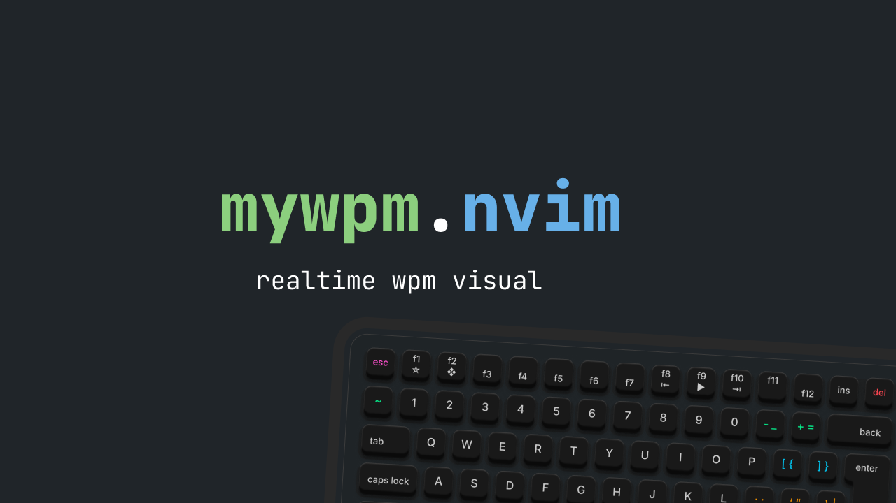

## Install with Lazy

```lua
{
    "slowy07/mywpm.nvim",
    configs = function()
        require("mywpm").setup({
            -- interval
            notify_interval = 60 * 1000,
            -- highest wpm
            high = 60,
            -- lowest wpm
            low = 15,

            -- highest wpm message
            high_msg = "nice keep it up 🔥",
            -- lowest wpm message
            low_message = "hahaha slowhand 🐌",

            -- show notify and virtual text
            show_virtual_text = true,
            notify = true,
             -- interval update time
            update_time = 300,
            -- overriding function to showing format
            virt_wpm = function(wpm)
                return ("👨‍💻 Speed: %.0f WPM"):format(wpm)
            end,
            -- position of virtual wpm position
            -- available `eol`, `right_align`, `inline`
            virt_wpm_pos = "right_align",
            
            -- follow the cursor when insert mode
            -- default (false)
            follow_cursor = true,
        })
    end
}
```

## Configuration
